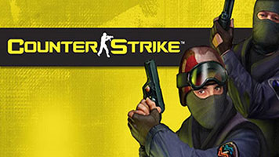

# Counter-Strike 1.6 Server by Reactor Team

## Features

* Run official `Counter-Strike` server in docker container with zero configuration

* Default address is `0.0.0.0` and port is `27015`

* AmxMod + Metamod + Podbots from the box

## Requirements to host and play

* `Linux` or compatible environment for host

* [Docker](https://docs.docker.com/engine/install/ubuntu/) with [docker-compose](https://docs.docker.com/compose/)

* [Official Counter-Strike 1.6 client](https://store.steampowered.com/app/10/CounterStrike/) (`Steam` client with `Counter-Strike` game installed)

## Setup

* Copy [this](https://github.com/alexnd/cs16server) repository to your work dir

* In your terminal set your work dir as current working directory (`cd` where `docker-compose.yaml` is)

* Run in your terminal: `chmod +x ./install`

* Run `./install` (or `docker-compose up -d`)

* After docker compose build job is done, run `./ps` to see status of `hlds` service

## Control scripts

* `./install` - Install and start docker container (`docker-compose up -d`)

* `./log` - Show service console logs (`docker-compose logs --follow hlds`)

* `./ps` - Show docker containers status (`sudo docker ps -a`)

* `./netstat` - Show network interfaces status (`sudo netstat -tunlp`)

* `./stop` - Stop service (`docker-compose stop hlds`)

* `./start` - Start service (`docker-compose start hlds`)

* `./restart` - Restart service (`./stop && ./start`)

* `./tty` - Enter interactive command shell (`docker-compose exec hlds /bin/bash`)

* `./reinstall` - Reinstall container (`docker-compose up -d --force-recreate`)

## Config files

`server.cfg`

`banned.cfg`

`listip.cfg`

`addons/amxmodx/configs/cvars.ini`

`addons/amxmodx/configs/maps.ini`

. . .

`addons/podbot/podbot.cfg`

## RTFM

* [Enable bridge in docker](https://docs.docker.com/network/bridge/)

* [Metamod](http://metamod.org/), [Metamod docs](http://metamod.org/metamod.html)

* [AmxModx](https://www.amxmodx.org/), [AmxModx docs](https://wiki.alliedmods.net/Category:Documentation_(AMX_Mod_X))

* [PODBot](http://podbotmm.bots-united.com/doc_v3/html/pbmm.html)

---

* **Counter-Strike** - is registered trademark of **[Valve](https://www.valvesoftware.com/en/)** corporation

